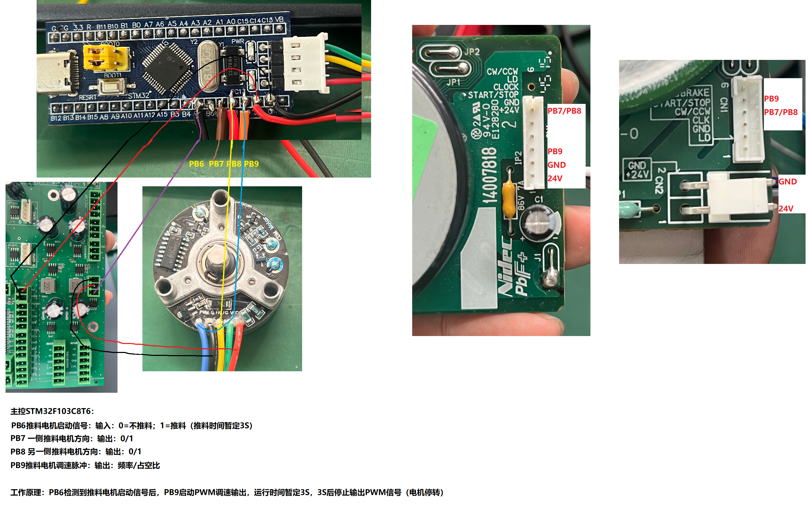

# Pusher Motor 项目说明

## 项目结构

本项目是基于STM32F103微控制器的推料电机控制系统，采用了模块化设计，主要包含以下目录和文件：

### 主要目录结构

```
├── Core/                 # 核心用户代码
│   ├── Inc/              # 头文件
│   │   ├── cli.h         # 命令行界面头文件
│   │   ├── flash_storage.h # Flash存储头文件
│   │   ├── main.h        # 主程序头文件
│   │   ├── params_manager.h # 参数管理器头文件
│   │   ├── pusher_motor.h # 推料电机控制头文件
│   │   └── stm32f1xx_hal_conf.h # STM32 HAL配置头文件
│   └── Src/              # 源文件
│       ├── cli.c         # 命令行界面实现
│       ├── flash_storage.c # Flash存储实现
│       ├── main.c        # 主程序实现
│       ├── params_manager.c # 参数管理器实现
│       └── pusher_motor.c # 推料电机控制实现
├── Drivers/              # 驱动文件
│   ├── CMSIS/            # CMSIS核心文件
│   └── STM32F1xx_HAL_Driver/ # STM32 HAL驱动
├── CMakeLists.txt        # CMake配置文件
└── Pusher_Motor.ioc      # STM32CubeMX配置文件
```

### 核心模块说明

1. **main.c**：主程序入口，负责系统初始化和主循环
2. **pusher_motor.c**：推料电机控制模块，实现电机的启动、停止和速度控制
3. **cli.c**：命令行界面模块，处理串口输入命令并执行相应操作
4. **flash_storage.c**：Flash存储模块，用于保存电机参数到Flash
5. **params_manager.c**：参数管理模块，提供统一的参数访问接口、有效性检查和持久化

## 如何运行

### 编译项目

1. 确保安装了STM32CubeIDE或其他支持STM32的编译环境
2. 使用CMake构建系统编译项目：

```bash
mkdir build && cd build
cmake ..
make
```

### 烧录到设备

1. 将STM32F103微控制器通过SWD或串口连接到电脑
2. 使用烧录工具（如ST-Link）将编译生成的固件烧录到设备

### 连接和控制

1. 通过串口（USART1）连接到设备，波特率默认为115200
2. 连接后会看到CLI欢迎信息
3. 输入`help`或`?`查看可用命令
4. 使用命令控制推料电机，例如：
   - `start`：启动推料电机
   - `set speed 100`：设置电机速度为100 cm/min
   - `set accel_time 1000`：设置启动加速时间为1000 ms
   - `get speed`：获取当前电机速度

### 售后上位机

`upper_computer/` 目录提供了 Python 桌面上位机，界面按钮会自动发送串口命令，适合非研发售后工程师做现场调试。Windows 运行和打包方法见 `upper_computer/README.md`。

### 参数管理

项目使用参数管理模块来管理电机参数，主要功能包括：

1. **参数初始化**：系统启动时自动从Flash加载参数，如果Flash数据无效则使用默认值
2. **参数设置**：通过CLI命令设置参数，参数会自动保存到Flash
3. **参数查询**：通过CLI命令查询当前参数值
4. **参数验证**：设置参数时会进行有效性检查，确保参数在合理范围内

### 串口通信

项目使用环形缓冲区处理串口数据，提高了数据处理效率和可靠性：

1. **接收缓冲区**：使用512字节的环形缓冲区接收串口数据
2. **发送缓冲区**：使用256字节的环形缓冲区发送数据
3. **非阻塞处理**：使用非阻塞方式处理串口数据，不影响主循环的执行
4. **数据回显**：支持命令行输入的回显功能，提高用户体验

### 程序运行详细流程

#### 1. 系统启动流程

1. **硬件初始化**：STM32F103复位后，首先执行启动文件`startup_stm32f103xb.s`，初始化堆栈指针和中断向量表
2. **系统初始化**：调用`SystemInit()`函数初始化系统时钟
3. **主函数入口**：跳转到`main()`函数开始执行
4. **HAL初始化**：调用`HAL_Init()`初始化HAL库，配置系统滴答定时器
5. **系统时钟配置**：调用`SystemClock_Config()`配置系统时钟为72MHz
6. **外设初始化**：依次初始化GPIO、TIM4（用于PWM输出）和USART1（用于串口通信）
7. **应用初始化**：
   - 调用`pusher_motor_init()`初始化推料电机，包括：
     - 启动PWM输出
     - 从Flash读取配置参数
     - 初始化电机状态为空闲状态
   - 调用`cli_init()`初始化命令行界面，包括：
     - 清空缓冲区
     - 发送欢迎信息

#### 2. 主循环执行过程

主循环位于`main()`函数中，执行以下操作：

```c
while (1)
{
    // 处理CLI输入
    cli_process();
    // 处理推料电机
    pusher_motor_loop();
}
```

1. **CLI处理**：调用`cli_process()`函数处理串口输入，包括：
   - 读取串口数据到环形缓冲区
   - 处理发送缓冲区（回显）
   - 解析命令
   - 执行命令
   - 发送响应

2. **电机控制**：调用`pusher_motor_loop()`函数处理电机状态，包括：
   - 检查启动标志
   - 管理电机状态机（空闲、等待、运行、停止）
   - 控制PWM输出
   - 管理工作标志

#### 3. 电机状态机流程

电机控制采用状态机设计，包含以下状态：

1. **空闲状态（MOTOR_STATE_IDLE）**：
   - 等待启动命令
   - 当收到启动命令时，进入等待状态

2. **等待状态（MOTOR_STATE_WAIT）**：
   - 等待设定的等待时间
   - 等待结束后，进入运行状态

3. **运行状态（MOTOR_STATE_RUNNING）**：
   - 按照设定的占空比输出PWM
   - 运行设定的时间
   - 运行结束后，进入停止状态

4. **停止状态（MOTOR_STATE_STOP）**：
   - 停止PWM输出
   - 清除工作标志
   - 回到空闲状态

#### 4. 命令处理流程

1. **命令输入**：用户通过串口发送命令
2. **数据接收**：`cli_receive_data()`函数读取串口数据到环形缓冲区
3. **命令解析**：`parse_command()`函数解析命令字符串
4. **命令执行**：`cli_execute_command()`函数执行相应命令
5. **状态反馈**：将执行结果发送回用户

#### 5. 参数存储流程

1. **参数读取**：系统启动时，`pusher_motor_init()`函数从Flash读取参数
2. **参数验证**：验证Flash数据的有效性
3. **参数使用**：使用读取的参数控制电机
4. **参数修改**：通过CLI命令修改参数
5. **参数保存**：`pusher_motor_save_params()`函数将修改后的参数保存到Flash

#### 6. 速度控制原理

1. **速度计算**：`pusher_motor_calculate_duty_from_speed()`函数根据目标速度计算PWM占空比
2. **占空比设置**：通过`__HAL_TIM_SetCompare()`函数设置PWM占空比
3. **速度反馈**：`pusher_motor_calculate_speed_from_duty()`函数根据当前占空比计算实际速度

#### 7. 中断处理

系统使用以下中断：

1. **系统滴答中断**：用于HAL库的延时和时间基准
2. **串口接收中断**：用于接收串口数据（当前实现使用轮询方式，可扩展为中断方式）
3. **定时器中断**：用于PWM输出控制

## 数据流向

### 系统数据流程

1. **命令输入**：用户通过串口发送命令
2. **命令解析**：CLI模块接收并解析命令
3. **命令执行**：根据命令执行相应操作
4. **参数存储**：配置参数保存到Flash
5. **电机控制**：根据参数控制电机运行
6. **状态反馈**：将执行结果和当前状态返回给用户

### 电机控制流程

1. **初始化**：系统启动时初始化推料电机和CLI
2. **等待命令**：主循环中等待用户命令
3. **命令处理**：处理CLI输入命令
4. **电机状态管理**：
   - 空闲状态：等待启动命令
   - 等待状态：启动后等待指定时间
   - 运行状态：电机按照设定参数运行
   - 停止状态：运行结束后停止电机
5. **参数更新**：根据命令更新电机参数

### 数据存储流程

1. **参数读取**：系统启动时从Flash读取参数
2. **参数使用**：使用读取的参数控制电机
3. **参数修改**：通过CLI命令修改参数
4. **参数保存**：修改后的参数保存到Flash

## 核心功能

### 1. 推料电机控制

- **速度控制**：通过PWM占空比控制电机速度
- **方向控制**：通过GPIO引脚控制电机方向
- **状态管理**：实现电机的状态机管理
- **速度计算**：根据占空比和最高转速计算实际速度

### 2. 命令行界面

- **命令解析**：解析用户输入的命令
- **参数设置**：设置电机相关参数
- **状态查询**：查询当前电机状态和参数
- **错误处理**：处理无效命令和参数
- **环形缓冲区**：使用环形缓冲区处理串口数据，提高数据处理效率

### 3. Flash存储

- **参数保存**：将配置参数保存到Flash
- **参数读取**：系统启动时从Flash读取参数
- **数据验证**：验证Flash数据的有效性

### 4. 参数管理模块

- **函数接口**：提供统一的参数访问接口，替代全局变量
- **参数验证**：在设置参数时进行有效性检查
- **参数持久化**：自动将参数保存到Flash
- **默认值管理**：当Flash数据无效时使用默认值

## 命令说明

| 命令 | 描述 | 示例 |
|------|------|------|
| start | 启动推料电机 | `start` |
| set mode <idle,service> | 切换系统模式 | `set mode service` |
| set direction_time <ms> | 设置运行时间（1-60000 ms） | `set direction_time 2500` |
| set pwm_duty <value> | 设置PWM占空比（0-500） | `set pwm_duty 250` |
| set wait_time <ms> | 设置等待时间（0-10000 ms） | `set wait_time 500` |
| set accel_time <ms> | 设置加速时间（0-10000 ms，0表示不启用斜坡） | `set accel_time 1000` |
| set max_speed <rpm> | 设置最高转速（1-10000 RPM） | `set max_speed 3700` |
| set speed <cm/min> | 设置速度（0+ cm/min） | `set speed 100` |
| set motor_mp_a_dir <0,1> |设置电机A的方向 | `set motor_mp_a_dir 0` |
| set motor_mp_b_dir <0,1> |设置电机B的方向 | `set motor_mp_b_dir 1` |
| set new_pwm_duty <value> | 售后调试模式下直接设置PWM占空比（不保存Flash） | `set new_pwm_duty 300` |
| get direction_time | 获取当前运行时间 | `get direction_time` |
| get pwm_duty | 获取当前PWM占空比 | `get pwm_duty` |
| get wait_time | 获取当前等待时间 | `get wait_time` |
| get accel_time | 获取当前加速时间 | `get accel_time` |
| get max_speed | 获取当前最高转速 | `get max_speed` |
| get speed | 获取当前速度 | `get speed` |
| get motor_mp_a_dir | 获取当前电机MP A方向 | `get motor_mp_a_dir` |
| get motor_mp_b_dir | 获取当前电机MP B方向 | `get motor_mp_b_dir` |
| get start_signal | 获取MOTOR_PM_ENABLE引脚电平（PB6） | `get start_signal` |
| get mode | 获取当前系统模式 | `get mode` |
| help / ? | 显示帮助信息 | `help` |

## 系统模式

固件显式区分系统模式，避免运行、保存参数和售后调试互相干扰：

| 模式 | 含义 |
|------|------|
| BOOT | 初始化中 |
| IDLE | 空闲，可配置，可启动 |
| RUNNING | 正在执行一次动作，保存型配置和启动命令会被拒绝 |
| SERVICE | 售后调试模式，允许临时PWM调试 |
| ERROR | 错误保护预留模式 |

`set new_pwm_duty` 只允许在 `SERVICE` 模式下执行。退出 `SERVICE` 模式时会强制停止PWM输出。

## 技术参数

- **微控制器**：STM32F103
- **电机控制**：PWM控制
- **串口通信**：USART1，波特率115200
- **Flash存储**：使用STM32内置Flash存储参数
- **电机参数**：
  - 电机直径：6cm
  - 最高转速：可配置，默认3655 RPM
  - PWM占空比范围：0-500，默认150
  - 默认运行时间：250 ms
  - 默认等待时间：250 ms
  - 默认电机A方向：高电平（1）
  - 默认电机B方向：低电平（0）

## 硬件连接

### 接线示意图



### 引脚说明

| 引脚 | 功能 | 说明 |
|------|------|------|
| PB6 | 启动信号 | 输入，上升沿触发，连接上游设备启动信号 |
| PB7 | 方向控制 B | 输出，连接电机驱动板方向引脚 |
| PB8 | 方向控制 A | 输出，连接电机驱动板方向引脚 |
| PB9 | PWM 调速 | 输出，TIM4_CH4，连接电机驱动板 PWM 输入 |
| PA9 | USART1_TX | 输出，调试串口发送 |
| PA10 | USART1_RX | 输入，调试串口接收 |

### 连接要求

- **共地**：主控板、驱动板、电机模块三者必须共地
- **供电**：主控板 3.3V，电机驱动板 24V（根据实际电机规格）
- **FG 信号**：电机模块的 FG 引脚悬空不接

## 注意事项

1. **参数范围**：设置参数时请确保在有效范围内，否则会被拒绝
2. **Flash寿命**：频繁写入Flash可能会影响Flash寿命，建议合理设置参数
3. **电机保护**：长时间运行电机可能会导致过热，请注意使用时间
4. **串口连接**：确保串口连接稳定，避免数据传输错误

## 故障排除

1. **电机不运行**：
   - 检查电机连接是否正确
   - 检查电源是否正常
   - 检查CLI命令是否正确

2. **参数保存失败**：
   - 检查Flash是否有足够空间
   - 检查参数是否在有效范围内

3. **串口通信问题**：
   - 检查串口连接
   - 检查波特率设置是否正确
   - 检查串口线是否完好

## 总结

本项目是一个功能完整的推料电机控制系统，通过模块化设计实现了电机控制、命令行界面和参数存储等功能。系统具有良好的可扩展性和可维护性，可以根据实际需求进行修改和扩展。
